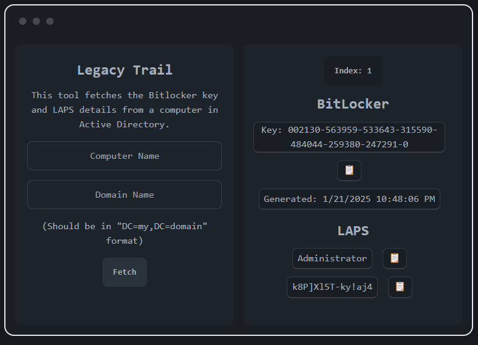

# Legacy Trail

A Blazor-based tool for retrieving BitLocker recovery keys and LAPS credentials from computers in Active Directory. 

## Features

* Provides an easy view of all Bitlocker keys a computer has generated with their creation date.
* Gets the LAPS password and username and lists the details in an easy to read view.
* Allows you to copy all details to the Clipboard for easy access.
* That's all really...
  
## Requirements

* Active Directory environment
* Appropriate permissions to read BitLocker and LAPS attributes
* .NET 8.0

## Built with...

* C#
* Tailwind
* DaisyUI
* Newtonsoft.Json
* Maui-Blazor Hybrid
* And a pinch of hate for Hybrid AD environments!

## Samples

